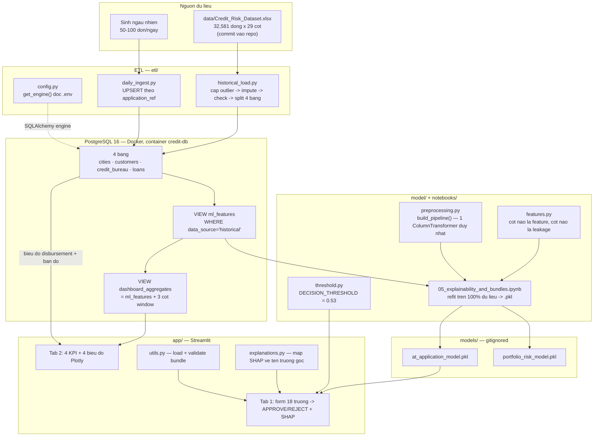
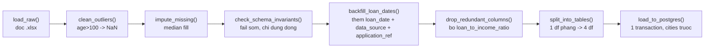
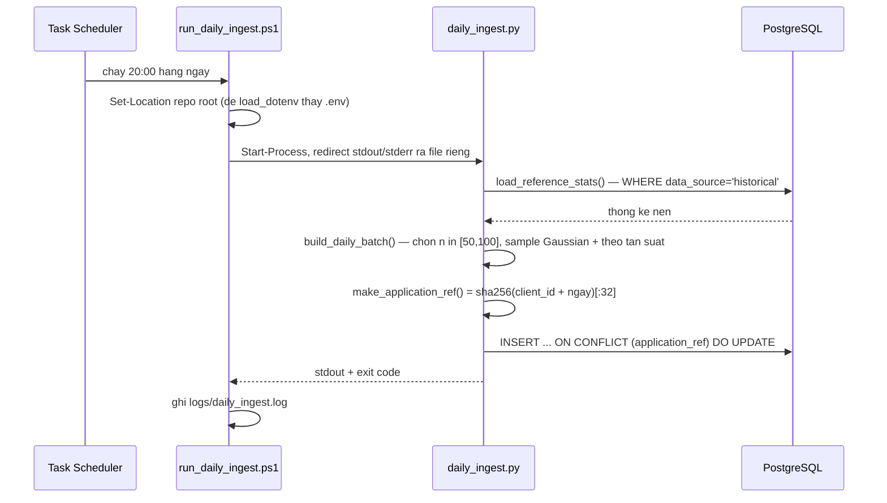
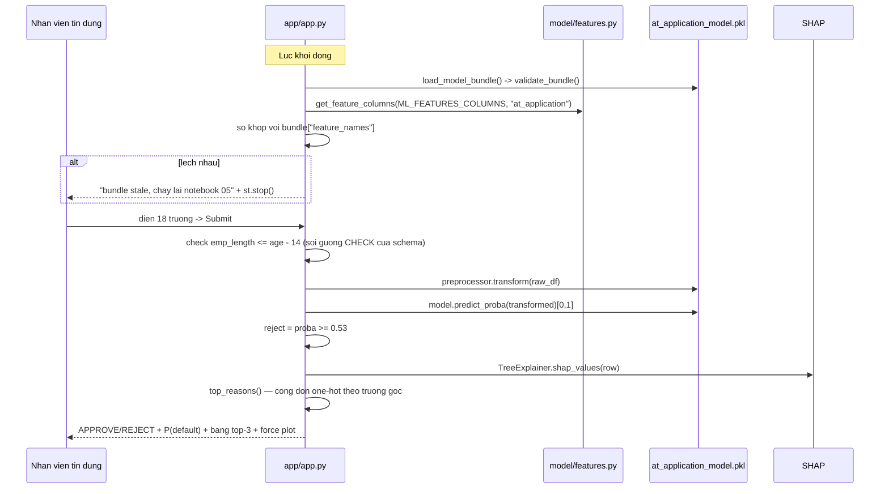
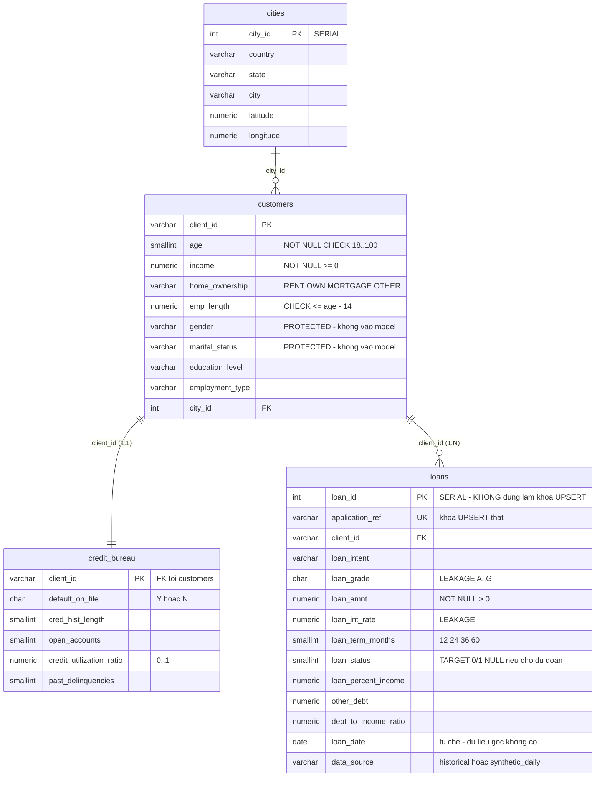

# EXPLAIN.md — Onboarding cho thành viên mới

> Tài liệu này viết cho **một engineer vừa join, chưa biết gì về repo**. Mục tiêu: sau khi đọc hết, bạn chạy được project ở local, biết sửa ở đâu, và biết chỗ nào dễ làm hỏng.
>
> Quy ước: mọi nhận định đều dẫn file cụ thể. Chỗ nào tôi không kiểm chứng được sẽ ghi rõ **"chưa chắc chắn"**.
>
> Hai file bắt buộc đọc song song với tài liệu này: [CLAUDE.md](CLAUDE.md) (các ràng buộc không được phá) và [docs/MEMORY.md](docs/MEMORY.md) (nhật ký "đã học được gì bằng cách làm sai", có ghi ngày).

---

## 1. Tổng quan — project này giải quyết vấn đề gì

**Bài toán nghiệp vụ**: một tổ chức cho vay nhận hồ sơ vay mới. Câu hỏi là *duyệt hay từ chối*, và phải trả lời **tại thời điểm hồ sơ vừa nộp** — lúc đó chưa có thông tin nào do chính quy trình thẩm định sinh ra.

Project dựng trọn một pipeline làm việc đó:

```
Excel (32,581 hồ sơ lịch sử)
  → PostgreSQL (4 bảng chuẩn hoá)
  → SQL views (feature engineering)
  → XGBoost (2 model tách biệt)
  → Streamlit app (duyệt/từ chối + dashboard danh mục)
```

**Cho ai**: có 2 nhóm người dùng, tương ứng 2 tab trong [app/app.py](app/app.py):

| Người dùng | Tab | Họ cần gì |
|---|---|---|
| Nhân viên tín dụng | Tab 1 "New Application Prediction" | Nhập 18 trường → nhận **APPROVE/REJECT** + P(default) + **3 lý do** đọc được bằng tiếng người |
| Quản lý danh mục | Tab 2 "Portfolio Dashboard" | 4 KPI + 4 biểu đồ mô tả sổ vay hiện có, đọc trực tiếp từ Postgres |

**Giá trị cốt lõi — đây là phần khác biệt so với một project ML thông thường.** Bản thân "train XGBoost dự đoán default" là bài tập phổ thông. Điểm đáng giá của repo này nằm ở **ba kỷ luật được cưỡng chế bằng cấu trúc, không phải bằng lời nhắc**:

1. **Chống data leakage bằng schema.** `loan_grade` và `loan_int_rate` dự đoán target gần như tuyệt đối (grade A→G: default rate 9.96% → 98.4%, xem [docs/MEMORY.md](docs/MEMORY.md) mục 2026-09-08), nhưng chúng là **đầu ra của thẩm định**, có sau quyết định mà model này tồn tại để đưa ra. Dùng chúng = AUC đẹp nhưng model không chạy được ngoài đời. Xem [model/features.py](model/features.py) `LEAKAGE_COLS`.
2. **Fair lending.** `gender` / `marital_status` bị loại khỏi **cả hai** model vì là protected attribute (US ECOA / Regulation B). Xem [model/features.py](model/features.py) `PROTECTED_ATTRIBUTE_COLS`.
3. **Ngưỡng quyết định suy từ kinh tế thật, không phải 0.5.** `DECISION_THRESHOLD = 0.53` trong [model/threshold.py](model/threshold.py), suy ra trong [notebooks/06_decision_threshold.ipynb](notebooks/06_decision_threshold.ipynb).

> **Bối cảnh cần biết**: đây là **portfolio project solo**, làm theo 17 "buổi" trong [docs/Credit_Risk_Pipeline_Plan_v3.md](docs/Credit_Risk_Pipeline_Plan_v3.md). Không phải hệ thống production đang phục vụ khách thật. Dữ liệu vay hằng ngày là **mô phỏng** ([etl/daily_ingest.py](etl/daily_ingest.py)). Hiểu điều này để không kỳ vọng nhầm về scale, SLA, hay monitoring.

---

## 2. Kiến trúc

### 2.1 Sơ đồ tổng thể



### 2.2 Ba điều về kiến trúc cần nắm ngay

**(a) `ml_features` và `dashboard_aggregates` là hai view riêng, cố ý.**
[sql/views.sql](sql/views.sql) tách chúng ra để **code training không có đường nào chạm tới** 3 cột window-function. Một trong ba cột đó là `default_rate_by_grade` = `AVG(loan_status) OVER (PARTITION BY loan_grade)` — tức **chính cái target**, tính trên toàn bảng trước khi split. Dùng nó làm feature còn tệ hơn dùng `loan_grade`.

> Đây là chỗ hay bị hỏi khi phỏng vấn: "làm sao anh chắc không leak?" Câu trả lời không phải "tôi nhớ là không dùng" mà là "**view đó không select được cột đó**" — có test canh: [tests/test_views.py](tests/test_views.py) `test_ml_features_excludes_the_dashboard_window_columns`.

**(b) Hai model, không phải một.**

| Bundle | Feature set | Có `loan_grade`/`loan_int_rate`? | Dùng ở đâu | CV ROC-AUC |
|---|---|---|---|---|
| `at_application_model.pkl` | `at_application` (18 cột) | **Không** | Tab 1 — quyết định thật | 0.8928 ± 0.0045 |
| `portfolio_risk_model.pkl` | `portfolio` (20 cột) | Có | Phân tích sổ vay hiện có | 0.9370 ± 0.0035 |

Chênh lệch ~0.044 ROC-AUC chính là **cái giá đo được của việc từ chối dùng dữ liệu leakage**. Số liệu từ [README.md](README.md) mục "What the app actually ships".

**(c) Tab 1 không cần database.**
[app/app.py:154-161](app/app.py#L154-L161) import `etl.config` **bên trong hàm** `get_db_engine()`, không ở module scope. Lý do: `etl/config.py` gọi `load_dotenv()` và đọc credentials ngay khi import. Nếu import ở đầu file, app sẽ chết khi không có `.env`. Kết quả: **chấm điểm một hồ sơ chỉ cần file `.pkl`**, Docker tắt vẫn chạy được Tab 1; Tab 2 hiện thông báo lỗi thân thiện ([app/app.py:352-359](app/app.py#L352-L359)).

---

## 3. Tech stack và lý do chọn

| Lớp | Công nghệ | Lý do (suy ra được từ code/docs) |
|---|---|---|
| Ngôn ngữ | **Python 3.14** ([.python-version](.python-version)) | Bản stable; [REVIEW.md](REVIEW.md) mục "Làm tốt #5" đã kiểm: mọi package import sạch, không cần downgrade, không có workaround nào. |
| Quản lý dep | **uv** ([pyproject.toml](pyproject.toml) + `uv.lock`) | Nguồn dependency **duy nhất** — không có `requirements.txt`. CI dùng `uv sync --locked` để build tái lập được. |
| Database | **PostgreSQL 16** qua Docker ([docker-compose.yml](docker-compose.yml)) | Cần window function (`RANK()`, `AVG() OVER`) cho dashboard views, và CHECK constraint làm hàng rào dữ liệu cuối cùng. |
| DB access | **SQLAlchemy 2.x + psycopg2** ([etl/config.py](etl/config.py)) | `pd.read_sql` / `to_sql` nhận engine trực tiếp; không có ORM vì ở đây không có domain object nào cần map. |
| ML | **scikit-learn + XGBoost** | XGBoost thắng Logistic Regression rõ rệt (PR-AUC 0.8055 vs 0.6240 trên `at_application`). Pipeline/ColumnTransformer của sklearn là thứ giữ kỷ luật fit-only-on-train. |
| Mất cân bằng lớp | **`scale_pos_weight`**, KHÔNG dùng SMOTE | Buổi 11 đo thật: PR-AUC 0.8055 vs 0.7796, fold range không chồng lấn. Xem [notebooks/04_smote_comparison.ipynb](notebooks/04_smote_comparison.ipynb). `imbalanced-learn` vẫn ở trong deps vì [model/preprocessing.py](model/preprocessing.py) hỗ trợ tham số `sampler=`. |
| Giải thích model | **SHAP** (`TreeExplainer`) | Yêu cầu nghiệp vụ: tín dụng phải giải thích được vì sao từ chối. |
| Vẽ | **matplotlib** (dependency chính, không phải dev) + **Plotly** | `shap.force_plot(matplotlib=True)` cần matplotlib **lúc runtime** trong app, không chỉ trong notebook — xem ghi chú ở [CLAUDE.md](CLAUDE.md) mục Stack. Plotly cho dashboard vì cần hover/zoom. |
| UI | **Streamlit** | Một file Python ra được app 2 tab; không cần frontend riêng cho scope này. |
| Test | **pytest** (dev dep) | |
| CI | **GitHub Actions** ([.github/workflows/ci.yml](.github/workflows/ci.yml)) | Có service `postgres:16` thật + apply `schema.sql`/`views.sql`, nên test SQL chạy thật trên CI chứ không bị skip. |

**Dev-only deps** (`uv add --dev`): `pytest`, `jupyter`, `kaleido` (export PNG tĩnh từ Plotly).

---

## 4. Cấu trúc code — đọc file nào trước

### 4.1 Thứ tự đọc đề xuất (khoảng 2 giờ)

| # | File | Vì sao đọc ở bước này |
|---|---|---|
| 1 | [CLAUDE.md](CLAUDE.md) mục **"Critical constraints"** | ~20 ràng buộc, mỗi cái có lý do và thường có test canh. Đây là "hiến pháp" của repo. |
| 2 | [sql/schema.sql](sql/schema.sql) | 81 dòng, mỗi bảng có comment giải thích vì sao thiết kế vậy. Hiểu data model trước khi hiểu code. |
| 3 | [sql/views.sql](sql/views.sql) | 58 dòng. Hiểu vì sao có **hai** view chứ không phải một query. |
| 4 | [model/features.py](model/features.py) | 75 dòng. Nguồn sự thật về "cột nào là feature". Mọi thứ khác đều tham chiếu về đây. |
| 5 | [etl/historical_load.py](etl/historical_load.py) | Đọc block `__main__` trước ([dòng 172-185](etl/historical_load.py#L172-L185)) để thấy thứ tự pipeline, rồi đọc ngược lên từng hàm. |
| 6 | [model/preprocessing.py](model/preprocessing.py) | `build_pipeline()` — điểm vào duy nhất của tiền xử lý, dùng chung cho mọi notebook. |
| 7 | [notebooks/02_baseline_model.ipynb](notebooks/02_baseline_model.ipynb) → `03` → `04` → `05` | Thấy được model tiến hoá thế nào. Notebook 05 là notebook sinh ra `.pkl`. |
| 8 | [app/app.py](app/app.py) | Đọc cuối, vì nó gọi mọi thứ ở trên. |

### 4.2 Bản đồ thư mục

```
sql/          Nguồn sự thật của DB.
              schema.sql  — DDL 4 bảng, comment rationale ngay dưới mỗi bảng
              views.sql   — ml_features (training) + dashboard_aggregates (chỉ Streamlit)

etl/          KHÔNG phải package (không có __init__.py). Import kiểu `from config import ...`
              → BẮT BUỘC chạy từ repo root.
              config.py            — get_engine(), gọi load_dotenv() ở module level
              historical_load.py   — nạp 1 lần từ Excel
              daily_ingest.py      — mô phỏng 50-100 đơn/ngày
              run_daily_ingest.ps1 — wrapper cho Windows Task Scheduler

model/        Package thật (có __init__.py). Logic ML thuần, không I/O.
              features.py      — ML_FEATURES_COLUMNS, LEAKAGE_COLS, PROTECTED_ATTRIBUTE_COLS
              preprocessing.py — build_preprocessor() / build_pipeline()
              bundle.py        — validate_bundle(): hợp đồng giữa notebook và app
              threshold.py     — DECISION_THRESHOLD = 0.53

models/       Artifact .pkl — GITIGNORED, không commit. Sinh lại bằng notebook 05.

notebooks/    01 EDA → 02 baseline → 03 XGBoost → 04 SMOTE → 05 bundles → 06 threshold
              figures/ — PNG export cho README

app/          KHÔNG phải package. app.py tự chèn sys.path ở dòng 13-16.
              app.py          — 505 dòng, 2 tab (xem "Điểm cần cẩn thận")
              explanations.py — tách ra để test được trong CI
              utils.py        — load_model_bundle()

tests/        pytest, 87 test
db-seed/      01_seed.sql (98,258 dòng) — Postgres tự nạp khi volume rỗng
scripts/      dump_db.sh — chụp lại db-seed từ DB đang chạy
data/         Credit_Risk_Dataset.xlsx — CÓ commit (cố ý)
docs/         Plan v3, MEMORY.md, images/
```

### 4.3 Entry points

Repo này **không có một entry point duy nhất** — nó là tập hợp script + app:

| Loại | Lệnh | File |
|---|---|---|
| App (cái bạn demo) | `streamlit run app/app.py` | [app/app.py](app/app.py) |
| ETL 1 lần | `python etl/historical_load.py` | [etl/historical_load.py:172](etl/historical_load.py#L172) |
| ETL hằng ngày | `python etl/daily_ingest.py` | [etl/daily_ingest.py:119](etl/daily_ingest.py#L119) |
| Sinh lại model | `uv run jupyter nbconvert --to notebook --execute --inplace notebooks/05_explainability_and_bundles.ipynb` | notebook 05 |
| Test | `uv run pytest tests/` | |

> `main.py` đã bị xoá (rác từ `uv init`) — xem [REVIEW.md](REVIEW.md) mục "Cần cải thiện #5". Đừng đi tìm nó.

---

## 5. Các luồng chính, từ đầu đến cuối

### Luồng A — Nạp dữ liệu lịch sử (chạy 1 lần)



Chi tiết trong [etl/historical_load.py:172-185](etl/historical_load.py#L172-L185). **Bốn điểm dễ làm sai:**

1. **Thứ tự cap-trước-impute là load-bearing.** Nếu impute trước, 5 dòng `age=144/123` sẽ kéo lệch median trước khi bị loại. Có test đối chứng cả hai chiều: `test_capping_before_imputing_keeps_outliers_out_of_the_median` ([tests/test_historical_load.py:94](tests/test_historical_load.py#L94)) — assert thứ tự đúng ra median 22.0, thứ tự sai ra 24.0.

2. **Bên trong `clean_outliers`, phải tính `bad_emp` TRƯỚC khi gán `age = NaN`** ([etl/historical_load.py:34-37](etl/historical_load.py#L34-L37)). Nếu NaN hoá age trước, phép so sánh `emp_length > age - 14` chạy trên `NaN` → luôn `False` → `emp_length` không được kiểm tra, rồi `impute_missing` điền `age = 26`, và dòng đó **vi phạm CHECK constraint lúc insert**. Đây là bug tiềm ẩn thật, đã fix 2026-09-19; trên dữ liệu hiện tại có 5 dòng `age>100` và 2 dòng `emp_length` sai nhưng **0 dòng dính cả hai** — nên nó chưa từng nổ, và chỉ bắt được bằng test dựng dòng nhân tạo: `test_clean_outliers_does_not_let_emp_length_ride_out_on_an_invalid_age`.

3. **`load_to_postgres` phải insert `cities` trước** ([etl/historical_load.py:155-169](etl/historical_load.py#L155-L169)), vì `city_id` là SERIAL — chỉ biết được giá trị sau khi insert, rồi mới merge ngược vào `customers`.

4. **`loan_date` và `data_source` là cột tự chế.** Dữ liệu gốc **không có cột ngày nào cả**; `backfill_loan_dates()` rải ngẫu nhiên trong 24 tháng gần nhất để biểu đồ xu hướng có gì mà vẽ. Đừng hiểu nhầm đây là ngày thật.

### Luồng B — Ingest hằng ngày (Windows Task Scheduler, 20:00)



**Điểm quan trọng:**

- **UPSERT theo `application_ref`, KHÔNG theo `loan_id`** ([etl/daily_ingest.py:101](etl/daily_ingest.py#L101)). `loan_id` là SERIAL — Postgres cấp giá trị mới mỗi lần insert, nên `ON CONFLICT (loan_id)` **không bao giờ khớp**. Đây là bug kinh điển, đã được viết thẳng vào comment.
- **`loan_status = None`** cho mọi dòng synthetic ([etl/daily_ingest.py:91](etl/daily_ingest.py#L91)) — hồ sơ mới nộp thì chưa có kết quả. Đây là lý do `loan_status` cho phép NULL trong schema.
- **Trùng client trong 1 ngày là chuyện bình thường, không phải bug.** `application_ref` hash `client_id + ngày`, nên nếu batch bốc trúng cùng một `client_id` hai lần trong một ngày, lần sau ghi đè lần trước → số dòng thực tế có thể **ít hơn** `n`. Đã ghi trong [CLAUDE.md](CLAUDE.md) mục Conventions.
- **`load_reference_stats` lọc `data_source='historical'`** ([etl/daily_ingest.py:49](etl/daily_ingest.py#L49)) để nhiễu synthetic không cộng dồn qua từng ngày.
- **Đừng sửa `.ps1` về dạng pipe `2>&1 | Out-String`.** Comment ở [etl/run_daily_ingest.ps1:4-10](etl/run_daily_ingest.ps1#L4-L10) giải thích: PowerShell 5.1 biến mỗi dòng stderr của exe thành ErrorRecord, nên dòng đầu traceback Python ném exception trước khi pipeline xong → log chỉ còn `"Traceback (most recent call last):"`. Hai entry log ngày 2026-09-10 và 09-11 đã mất nguyên nhân vì lý do này.

### Luồng C — Chấm điểm một hồ sơ (Tab 1)



**Bốn chi tiết mà người mới hay hiểu sai:**

1. **`preprocessor.transform()` rồi `model.predict_proba()` — HAI bước rời, không phải `pipeline.predict()`.** [app/app.py:254-255](app/app.py#L254-L255). Bundle lưu `ColumnTransformer` **riêng**, không lưu cả `Pipeline`. Xem [CLAUDE.md](CLAUDE.md) mục về `bundle["preprocessor"]`.

2. **Form dựng từ `model/features.py`, rồi *đối chiếu* với bundle** ([app/app.py:209-219](app/app.py#L209-L219)). Không dùng list gõ tay (sẽ stale âm thầm), cũng không dùng riêng `bundle["feature_names"]` (chỉ ghi lại đúng một artifact tình cờ chứa gì). Lệch nhau → báo lỗi rõ ràng + `st.stop()`, chứ không chấm điểm bằng preprocessor được fit trên bộ cột khác.

3. **Ngưỡng 0.53, không phải 0.5** ([model/threshold.py](model/threshold.py)). `predict_proba` của model này **không phải xác suất đã hiệu chỉnh** — `scale_pos_weight` làm lệch thang điểm. Đã đo trong notebook 06: ở score ~0.50, tỷ lệ default thật trong bin đó chỉ ~24%. Nên mọi công thức sách (kể cả `t* = C_FP/(C_FP+C_FN)`, cho ra 0.267) đều sai. 0.53 tìm bằng cách quét mọi cutoff trên test set và chọn cái **tối thiểu chi phí thật tính bằng đô la** ($721/hồ sơ, so với 0.5 → $743, Youden's J → $761, recall≥90% → $1,006).

4. **SHAP chạy trên không gian *đã transform* (35 cột one-hot), không phải 18 cột form.** [app/explanations.py](app/explanations.py) `top_reasons()` **cộng dồn các cột one-hot của cùng một trường trước khi xếp hạng**. Không cộng thì: (a) một trường chiếm hai dòng trong bảng "top 3" với cùng nhãn (`default_on_file_N` và `default_on_file_Y`), và (b) tệ hơn — có ca thật: driver là cột `default_on_file_N` trong khi hồ sơ thực tế là `'Y'`, báo tên cột ra cho nhân viên tín dụng sẽ nói **ngược hẳn sự thật**. Xem [docs/MEMORY.md](docs/MEMORY.md) mục session 15-16 "Near-boundary test case".

### Luồng D — Dashboard Tab 2

Mỗi biểu đồ đọc nguồn khác nhau, và **mỗi lựa chọn có lý do được ghi ngay trên query**:

| Biểu đồ | Nguồn | Vì sao |
|---|---|---|
| Default rate theo grade | `dashboard_aggregates` ([app/app.py:97](app/app.py#L97)) | Dùng cột window `default_rate_by_grade` đã tính sẵn — không tính lại `AVG()` trong pandas |
| Default rate theo country | `dashboard_aggregates` ([app/app.py:109](app/app.py#L109)) | Không có cột window sẵn nên aggregate bằng SQL — vẫn không phải pandas |
| **Monthly disbursement** | **bảng `loans` thô** ([app/app.py:123](app/app.py#L123)) | View kế thừa `WHERE data_source='historical'` nên **về mặt cấu trúc không thấy được** dòng `synthetic_daily` — mà đó chính là thứ biểu đồ này sinh ra để theo dõi |
| Bản đồ theo city | join bảng thô ([app/app.py:137](app/app.py#L137)) | `cities.latitude/longitude` không nằm trong `ml_features` (chúng không phải feature của model) |

**Hai quy tắc trình bày không được phá:**

- **Không để autoscale bịa ra chênh lệch rủi ro không có thật.** Query lại DB sống ngày 2026-09-21: default rate giữa 3 nước chênh nhau **0.13pp** (Canada 21.86 / UK 21.73 / USA 21.86); giữa **18 thành phố** là **20.43%–24.19%, tức 3.76pp** quanh mức 21.82%. Để Plotly tự scale thì cả hai đều hiện ra như đỏ-xanh kịch tính. Nên chart country ghim `yaxis_range=[0, 0.3]` + một màu phẳng ([app/app.py:460](app/app.py#L460)), bản đồ ghim `range_color=[0, 0.5]` ([app/app.py:486](app/app.py#L486)). Đây là lỗi **đã thực sự xảy ra** trong buổi 15-16, không phải giả định.
- **Historical và synthetic phải là hai trace riêng, không bao giờ cộng lại** ([app/app.py:384-392](app/app.py#L384-L392)) — dòng synthetic có nhãn sampled/NULL, không cùng tư cách thống kê với kết quả thật.

---

## 6. Data model

### 6.1 ERD



### 6.2 Tại sao **4 bảng**, không phải 5

> ⚠️ Con số này **đã bị ghi nhầm thành "5 bảng" hai lần** trong các bản plan. Nếu bạn thấy tài liệu nào nói 5, tài liệu đó sai. Xem [CLAUDE.md](CLAUDE.md) mục "The schema has 4 tables".

- `cities` tách riêng vì cả bộ dữ liệu chỉ có **18 tổ hợp (country, state, city)** phân biệt, mỗi tổ hợp có lat/long cố định. Nhúng thẳng vào `customers` là lặp toạ độ 32,581 lần cho 18 giá trị thật → giữ 3NF.
- Không có bảng `locations` riêng. `customers.city_id` là FK thường, vì quan hệ customer→city là 1:1 tại mỗi thời điểm.

### 6.3 Những cột cần hiểu đúng

| Cột | Ý nghĩa thật |
|---|---|
| `loans.loan_status` | **Target**. 1 = default. Base rate 21.82%. `NULL` = hồ sơ synthetic chờ dự đoán |
| `loans.data_source` | Bộ lọc an toàn. `ml_features` chỉ lấy `'historical'` |
| `loans.application_ref` | Khoá UPSERT. Historical = `uuid4`; daily = `sha256(client_id + ngày)[:32]` |
| `loans.loan_date` | **Tổng hợp**, không phải ngày thật |
| `loan_grade`, `loan_int_rate` | Đầu ra của thẩm định → leakage với model at-application |
| `gender`, `marital_status` | Protected attribute → không vào model nào |
| `country` | **Cố ý giữ lại** — phân khúc địa lý là hợp pháp, và dashboard dùng nó |

**Cảnh báo về chất lượng dữ liệu**: buổi 8 đã quét và thấy **9 trong 18 feature at-application gần như là nhiễu thuần tuý** — `past_delinquencies` single-feature AUC 0.5004, `open_accounts` 0.4980, `credit_utilization_ratio` 0.5051. Đây gần như chắc chắn là các cột được sinh thêm (augment) độc lập với target. Tín hiệu thật đến từ các cột của dataset gốc. Đừng ngạc nhiên khi thấy SHAP gán importance cho các cột này — đó là fit nhiễu.

---

## 7. Setup môi trường

### 7.1 Cần có sẵn

- **Docker Desktop** (đang chạy)
- **uv** ([docs.astral.sh/uv](https://docs.astral.sh/uv/))
- Python 3.14 — `uv` sẽ tự cài theo [.python-version](.python-version)
- Repo này phát triển trên **Windows 11 + PowerShell**; `scripts/dump_db.sh` cần bash (Git Bash có sẵn)

### 7.2 Đường nhanh nhất (khuyên dùng) — khôi phục từ snapshot

```bash
cp .env.example .env
uv sync                    # cài từ pyproject.toml + uv.lock
docker compose up -d       # db-seed/01_seed.sql tự nạp khi volume rỗng
uv run pytest tests/       # kỳ vọng: 85 passed, 2 skipped
uv run streamlit run app/app.py
```

`db-seed/01_seed.sql` (98,258 dòng) được mount vào `/docker-entrypoint-initdb.d`, Postgres tự nạp **một lần khi volume trống** — gồm cả schema, dữ liệu, và 2 view. **Không cần chạy lại ETL chỉ để có dữ liệu.**

⚠️ **Nhưng `models/*.pkl` bị gitignore.** Sau khi clone mới bạn **phải** sinh lại trước khi mở app:

```bash
uv run jupyter nbconvert --to notebook --execute --inplace notebooks/05_explainability_and_bundles.ipynb
```

### 7.3 Dựng lại từ đầu (chỉ khi cần)

```bash
docker compose down -v && docker compose up -d      # volume trống
docker exec -i credit-db psql -U postgres -d credit_db -f - < sql/schema.sql
docker exec -i credit-db psql -U postgres -d credit_db -f - < sql/views.sql
uv run python etl/historical_load.py     # PHẢI chạy từ repo root
uv run python etl/daily_ingest.py
bash scripts/dump_db.sh                  # cập nhật lại db-seed/01_seed.sql
```

### 7.4 Biến môi trường

[.env.example](.env.example) → copy thành `.env` (đã gitignore):

```
DB_HOST=localhost
DB_PORT=5432
DB_NAME=credit_db
DB_USER=postgres
DB_PASSWORD=xxx
```

[etl/config.py](etl/config.py) gọi `load_dotenv()` **ở module level** (dòng 6). Bỏ dòng đó đi thì mọi script sẽ `KeyError` trên `os.environ['DB_USER']` **dù `.env` tồn tại** — đây là lỗi đã thực sự xảy ra và làm hỏng mọi thứ cho tới khi được sửa.

### 7.5 Lỗi thường gặp — bảng tra cứu

| Triệu chứng | Nguyên nhân | Xử lý |
|---|---|---|
| `psql: No such file or directory` khi apply schema | `docker exec ... -f sql/schema.sql` tìm path **bên trong container**, mà container chỉ mount `./db-seed` | Dùng dạng `-f - < sql/schema.sql` (đọc từ stdin do shell host cấp). Đã xác minh 2026-09-12 |
| `KeyError: 'DB_USER'` | Chạy script **không phải từ repo root**, hoặc thiếu `.env` | `cd` về repo root rồi chạy lại |
| `FileNotFoundError: data/Credit_Risk_Dataset.xlsx` | `SOURCE_FILE` resolve theo **cwd**, không phải thư mục script | Luôn chạy ETL từ repo root |
| `UnicodeEncodeError` **sau khi** DB đã ghi xong | Console Windows mặc định cp1252, script in tiếng Việt | Đã xử lý bằng `sys.stdout.reconfigure(encoding="utf-8")` trong các block `__main__`. **Đừng nhầm lỗi này với lỗi dữ liệu** — DB đã ghi thành công rồi |
| Nhiều test bị `SKIPPED` khi chạy pytest | Docker chưa bật — các test cần DB tự skip (đúng thiết kế) | `docker compose up -d` rồi chạy lại. Docker tắt: 76 passed / 11 skipped / **0 failed**; Docker bật: 85 passed / 2 skipped |
| App báo "bundle is stale, re-run notebook 05" | `model/features.py` đổi nhưng `.pkl` chưa sinh lại | Chạy lại notebook 05 |
| Apply `views.sql` báo `cannot change name of view column` | `ml_features` vừa được thêm cột → đổi vị trí cột của `dashboard_aggregates` | `DROP VIEW dashboard_aggregates;` rồi apply lại — đã ghi trong comment tại [sql/views.sql:40-45](sql/views.sql#L40-L45) |
| Sửa `.env` password rồi mà vẫn không kết nối được | Postgres **chỉ đọc `POSTGRES_USER/PASSWORD/DB` khi volume còn trống** — đổi trên volume đã khởi tạo thì không có tác dụng gì | `docker compose down -v && docker compose up -d` (xoá volume, nạp lại `db-seed/`). Từ 2026-09-21 compose đã đọc `.env` nên hai bên không còn lệch nhau nữa |
| `required variable DB_PASSWORD is missing a value` khi `docker compose up` | Chưa có `.env` | `cp .env.example .env`. Đây là lỗi **cố ý** — trước đây compose im lặng dùng giá trị hard-code |

---

## 8. Quy ước của team

### 8.1 Git — đọc kỹ, đây là chỗ khác biệt nhất

**Quy tắc số 1: CHỈ commit / push / mở PR / merge khi người dùng nói rõ trong chính message đó.** Sửa bug, làm feature, chạy review — **không** tự động kéo theo quyền đụng vào git. Làm xong thì dừng lại, báo cáo là code đã sửa và **chưa commit**. (Áp dụng từ 2026-09-13, ghi trong [CLAUDE.md](CLAUDE.md) mục "Git workflow".)

Khi đã được yêu cầu, mọi thay đổi đều đi qua: **feature branch → PR → self-review → merge**. Kể cả làm một mình. **Không bao giờ commit thẳng vào `main`.**

```bash
git checkout -b feat/short-description     # <type>/<mô tả ngắn>
# commit, push
gh pr create                               # mô tả: cái gì đổi, vì sao, verify thế nào
gh pr diff                                 # self-review (GitHub không cho tự Approve)
gh pr merge --squash --delete-branch        # sau khi CI xanh
```

### 8.2 PR hygiene (3 thói quen bắt buộc)

1. **Khai báo có AI tham gia.** Mỗi commit kết thúc bằng `Co-Authored-By: Claude ... <noreply@anthropic.com>`; mỗi mô tả PR kết thúc bằng dòng attribution của Claude Code.
2. **Một thay đổi một PR.** Thấy bug không liên quan dọc đường thì tách nhánh riêng (ví dụ PR #6 tách một lần re-save notebook và một fix editor-config ra khỏi PR #5).
3. **Verify trước khi nói "xong".** Code viết xong chưa phải là xong — phải chạy thật: query DB sống, `pytest`, hoặc re-execute notebook bằng `nbconvert`. **Đừng mở PR mà mục "Test plan" mô tả những bước chưa từng chạy.**

### 8.3 Coding style — quan sát được từ code

- **Comment giải thích *vì sao*, không giải thích *cái gì*.** Đây là đặc trưng rõ nhất của repo. Ví dụ mẫu: [model/preprocessing.py:82-109](model/preprocessing.py#L82-L109) (docstring của `build_pipeline`) và [app/app.py:64-84](app/app.py#L64-L84) (vì sao chọn phương án (b) cho SHAP explainer). Comment thường ghi luôn *phương án đã bị loại và lý do*.
- **Docstring nêu rõ ràng buộc và hệ quả nếu phá vỡ**, thường kèm tên test đang canh nó.
- **Logic feature nằm trong [sql/views.sql](sql/views.sql), không lặp lại trong pandas.** Query `ml_features`/`dashboard_aggregates` rồi `pd.read_sql` — đừng viết lại join bằng Python.
- **Mọi truy cập Postgres đi qua [etl/config.py](etl/config.py) `get_engine()`.** Không hard-code credentials, ở bất kỳ đâu.
- **Artifact model lưu dạng dict bundle**, không bao giờ lưu model trần — app cần `preprocessor` để transform input y hệt lúc train.
- Tên test là **câu mô tả hành vi**, không phải tên hàm: `test_capping_before_imputing_keeps_outliers_out_of_the_median`, `test_clean_outliers_does_not_let_emp_length_ride_out_on_an_invalid_age`.

### 8.4 Testing

Triết lý của repo: **một ràng buộc chỉ "có thật" khi có test làm nó đỏ lên nếu bị phá**. Nhiều test ở đây kiểm cái mà test thông thường không kiểm được:

| Test | Nó canh cái gì |
|---|---|
| [tests/test_preprocessing.py:158](tests/test_preprocessing.py#L158) `test_notebook_does_not_fit_before_train_test_split` | Quét **source của notebook** để bắt fit-trước-split. Docstring giải thích vì sao assertion ở tầng pipeline **về nguyên tắc không thể** bắt được: `ColumnTransformer.fit` clone rồi refit, xoá sạch dấu vết |
| [tests/test_historical_load.py:94](tests/test_historical_load.py#L94) | Assert **cả hai chiều**: thứ tự đúng ra median 22.0, thứ tự sai ra 24.0 |
| [tests/test_views.py](tests/test_views.py) | Chạy trên DB sống: đúng 4 bảng, `ml_features` không chứa cột window, `application_ref` là UNIQUE chứ không phải `loan_id` |
| [tests/test_model_bundles.py:44](tests/test_model_bundles.py#L44) | Đối chiếu `bundle["trained_on_n_rows"]` với `SELECT COUNT(*)` chạy **độc lập** — phân biệt "field tồn tại" với "đã kiểm chứng" |

**Phân tầng test theo yêu cầu môi trường:**

| Nhóm | Cần gì | Chạy ở CI? |
|---|---|---|
| `test_features`, `test_preprocessing`, `test_bundle`, `test_threshold`, `test_app_explanations`, `test_historical_load`, `test_daily_ingest` | Không cần gì | ✅ |
| `test_views` | Postgres sống | ✅ (CI có service postgres + apply schema) |
| `test_model_bundles` | Postgres **và** `models/*.pkl` | ❌ (`.pkl` gitignored, chỉ chạy local) |

### 8.5 CI/CD

[.github/workflows/ci.yml](.github/workflows/ci.yml) — chạy trên mọi push vào `main` và mọi PR về `main`:

1. `astral-sh/setup-uv@v5` + `uv python install`
2. `uv sync --locked`
3. Apply `sql/schema.sql` + `sql/views.sql` vào service postgres (**gọi `psql` trực tiếp trên runner**, không qua `docker exec` — nên ở đây `-f sql/schema.sql` chạy được bình thường)
4. `uv run pytest tests/ -v`

CI **không** deploy gì cả — đây là portfolio project, không có môi trường production. **Check đỏ là tín hiệu phải sửa trước khi merge, không phải để bỏ qua.**

---

## 9. Thuật ngữ

### Nghiệp vụ tín dụng

| Từ | Nghĩa trong project này |
|---|---|
| **Default** | Khách không trả được nợ. `loan_status = 1` |
| **Base rate** | Tỷ lệ default nền của toàn bộ dữ liệu = **21.82%** |
| **At-application** | Thời điểm hồ sơ vừa nộp, **trước** thẩm định. Chỉ dữ liệu có ở thời điểm này mới được làm feature |
| **Underwriting (thẩm định)** | Quy trình sinh ra `loan_grade` và `loan_int_rate` — tức là chúng có **sau** quyết định duyệt |
| **Loan grade** | Xếp hạng rủi ro A..G do underwriter gán. A=9.96% default → G=98.4% |
| **Credit bureau** | Trung tâm thông tin tín dụng. Bảng `credit_bureau` |
| **`default_on_file`** | Khách đã từng default trước đây chưa (Y/N) |
| **`loan_percent_income`** | Khoản vay / thu nhập |
| **Disbursement** | Số tiền đã giải ngân = `SUM(loan_amnt)` |
| **Recovery rate** | Tỷ lệ thu hồi được khi default. Ở đây giả định **0%** (bảo thủ — dataset không có dữ liệu thu hồi) |
| **ECOA / Regulation B** | Luật cho vay công bằng của Mỹ — cấm dùng protected attribute để quyết định tín dụng. Canada và UK có luật tương đương; cả 3 nước đều có trong dataset |

### ML / Thống kê

| Từ | Nghĩa |
|---|---|
| **Leakage** | Feature chứa thông tin chỉ tồn tại **sau** thời điểm cần dự đoán → model đẹp trên giấy, vô dụng ngoài đời |
| **Protected attribute** | Thuộc tính bị luật cấm dùng làm đầu vào quyết định tín dụng. Ở đây: `gender`, `marital_status` |
| **PR-AUC** | Area under Precision-Recall curve. **Metric chính của project.** Baseline của nó **chính là base rate** (0.218) |
| **ROC-AUC** | Vẫn báo cáo, nhưng ít nghiêm khắc hơn khi lệch lớp vì FPR chia cho lớp âm rất lớn |
| **Vì sao không dùng accuracy** | Đoán "không default" cho tất cả đã được **78.2%** accuracy và hoàn toàn vô dụng |
| **`scale_pos_weight`** | Tham số XGBoost nhân trọng số lớp thiểu số trong hàm loss. Bundle dùng **3.5837** (suy từ toàn bộ dữ liệu) |
| **SMOTE** | Sinh dòng thiểu số nhân tạo. **Đã thử và bị loại** ở buổi 11 |
| **Calibration** | Điểm số dự đoán có đúng là xác suất thật không. Model này **không** calibrated — đó là lý do ngưỡng ≠ 0.5 |
| **`StratifiedKFold(shuffle=True)`** | **Bắt buộc** — dữ liệu không ngẫu nhiên theo thứ tự dòng (default rate 5 khối liên tiếp: 27.8/19.1/24.3/18.0/20.0%). Dùng `cv=5` trần đã từng cho ra một kết luận sai được công bố |
| **SHAP** | SHapley Additive exPlanations. Phân rã một dự đoán thành đóng góp từng feature. **Cộng được** — đó là cơ sở toán học để `top_reasons()` cộng dồn các cột one-hot |
| **Force plot** | Biểu đồ SHAP cho một dự đoán. **Trục là log-odds, không phải xác suất** — f(x) trên đó không so sánh trực tiếp được với P(default) |
| **MCAR / MAR** | Missing Completely At Random / At Random. Buổi 8 xác nhận missingness ở đây trông MCAR → median imputation là hợp lý |
| **Bundle** | Dict gồm `model`, `preprocessor`, `feature_names`, `trained_at`, `metrics`, `trained_on_n_rows`. Hợp đồng định nghĩa ở [model/bundle.py](model/bundle.py) |
| **Holdout vs CV** | Bundle lưu **CV mean** ở `metrics["roc_auc"]`; số holdout chỉ để đối chiếu ở `metrics["holdout_roc_auc"]` |

### Kỹ thuật / DB

| Từ | Nghĩa |
|---|---|
| **UPSERT** | `INSERT ... ON CONFLICT ... DO UPDATE`. Khoá ở đây là `application_ref` |
| **SERIAL** | Kiểu tự tăng của Postgres. Luôn cấp giá trị mới → **không dùng được làm khoá conflict** |
| **Window function** | `AVG() OVER (PARTITION BY ...)`. 3 cột như vậy chỉ tồn tại ở `dashboard_aggregates` |
| **3NF** | Chuẩn hoá bậc 3 — lý do `cities` là bảng riêng |
| **`data_source`** | `'historical'` (thật) vs `'synthetic_daily'` (mô phỏng). Bộ lọc an toàn chống train nhầm |
| **`handle_unknown="ignore"`** | OneHotEncoder gặp category lạ thì mã hoá thành toàn 0 thay vì ném lỗi — để form không làm sập app |
| **"buổi"** | = "session". Tài liệu plan dùng tiếng Việt; code/comment dùng "session". Cùng một thứ |

---

## 10. Điểm cần cẩn thận

### 10.1 🔴 Ràng buộc KHÔNG được phá (phá là hỏng đúng chỗ khó phát hiện nhất)

1. **Không bao giờ thêm `loan_grade` / `loan_int_rate` vào feature set at-application.**
2. **Không bao giờ đưa `gender` / `marital_status` vào model nào.**
3. **Code training query `ml_features`, không bao giờ query `dashboard_aggregates`.**
4. **Không bao giờ train trên dòng `data_source = 'synthetic_daily'`.** Nhãn của chúng là NULL hoặc sampled.
5. **Cap outlier trước, impute sau.** Và bên trong `clean_outliers`, tính `emp_length` **trước** khi NaN hoá `age`.
6. **Cross-validate bằng `StratifiedKFold(shuffle=True, random_state=...)`**, không bao giờ `cv=5` trần.
7. **Số liệu trong bundle không bao giờ được tính bằng cách chấm model refit trên chính dữ liệu train của nó.**
8. **Biểu đồ dashboard không được để autoscale bịa ra chênh lệch rủi ro.**

Danh sách đầy đủ có lý do chi tiết: [CLAUDE.md](CLAUDE.md) mục "Critical constraints".

### 10.2 🟡 Code phức tạp / dễ hỏng

| Chỗ | Vấn đề |
|---|---|
| [app/app.py](app/app.py) — **505 dòng** | Gánh 3 việc: form, SHAP, và query + chart của dashboard. [REVIEW.md](REVIEW.md) mục "Cần cải thiện #7" đề xuất tách `app/dashboard.py`. **Chưa chặn gì**, nhưng là file lớn nhất repo |
| `sys.path.insert` rải rác | [app/app.py:13-16](app/app.py#L13-L16), [app/utils.py:7](app/utils.py#L7), và **mọi file test**. `etl/` và `app/` không phải package (không có `__init__.py`), chỉ `model/` mới là. Hệ quả: **thứ tự import mong manh** và ETL bắt buộc chạy từ repo root |
| `st.cache_data` | **Loader không tham số sẽ không nhận ra SQL string định nghĩa bên ngoài đã đổi.** Đã gây `KeyError` thật lúc dev. Nên [app/app.py:165](app/app.py#L165) truyền `sql` vào làm tham số để nó thành một phần của cache key. **Đừng "dọn dẹp" bằng cách bỏ tham số đó đi** |
| `CREATE OR REPLACE VIEW` | Postgres chỉ cho **thêm cột ở cuối**, không cho đổi thứ tự. Thêm cột vào `ml_features` sẽ làm `dashboard_aggregates` lỗi → phải `DROP VIEW` trước |
| [etl/run_daily_ingest.ps1](etl/run_daily_ingest.ps1) | Hình dạng hiện tại là **có chủ đích** (xem mục 5, luồng B). Đổi về dạng pipe sẽ âm thầm cắt mất traceback trong log |
| `notebooks/04` — `scale_pos_weight` | Lấy tham số từ `train_df` nhưng CV trên **toàn bộ** `df` → hyperparameter suy từ dữ liệu nằm trong chính các fold của phép CV đó. Ảnh hưởng không đáng kể với một tỷ lệ class, nhưng **không nhất quán nếu bị hỏi**. Ghi trong [REVIEW.md](REVIEW.md) mục "Cần cải thiện #2" |

### 10.3 🟠 Vùng chưa có test / tech debt (đã kiểm chứng, không phải phỏng đoán)

**Đã verify bằng `grep -rl <tên hàm> tests/`:**

| Thứ | Trạng thái |
|---|---|
| `etl/daily_ingest.py::upsert_loans` | **Không có test nào tham chiếu.** Đây là hàm ghi DB của luồng ingest hằng ngày |
| `etl/daily_ingest.py::load_reference_stats` | **Không có test nào tham chiếu** |
| `etl/historical_load.py::load_to_postgres` | Chỉ được nhắc trong comment/docstring của test, **không có test hành vi**. [tests/test_historical_load.py:5](tests/test_historical_load.py#L5) nói rõ điều đó — cố ý, vì nó chạm DB |
| `app/app.py` | **Không có test tự động nào.** Toàn bộ verify là thủ công bằng Playwright, ghi lại trong [docs/MEMORY.md](docs/MEMORY.md) session 13-17 |
| `app/utils.py::load_model_bundle` | Hợp đồng được test gián tiếp qua `validate_bundle` ([tests/test_bundle.py](tests/test_bundle.py)); bản thân hàm loader thì không |

**✅ Đã sửa ngày 2026-09-21** (bốn lỗi dưới đây từng nằm ở mục này; giữ lại để bạn biết chúng từng tồn tại và đã được đóng thế nào):

| Lỗi | Trạng thái |
|---|---|
| `tests/test_model_bundles.py` **fail thay vì skip** khi Docker tắt (2 failed) | ✅ Thêm fixture `db_engine` sở hữu `pytest.skip`, cả hai test cùng phụ thuộc vào nó. Verify hai chiều: DB bật → 4 passed; `DB_PORT=59999` → 9 skipped, **0 failed** |
| [README.md](README.md) mở đầu nói *"Session 17 ... is the remaining one"* | ✅ Sửa thành "All 17 sessions are built" (session 17 đã merge ở `f0c91c8`) |
| [docker-compose.yml](docker-compose.yml) hard-code `POSTGRES_PASSWORD: xxx`, không đọc `.env` | ✅ Chuyển sang `${DB_USER}` / `${DB_PASSWORD}` / `${DB_NAME}` / `${DB_PORT}` dạng `:?` — thiếu `.env` thì báo lỗi rõ ràng thay vì thay bằng chuỗi rỗng |
| README "Running from scratch" **không có bước sinh lại `models/*.pkl`** nhưng lại kết thúc bằng `streamlit run app/app.py` | ✅ Thêm bước notebook 05 + ghi chú "hai thứ hay cắn trên clone mới". Trên clone mới, thiếu bước này thì app fail ngay lúc import |

**Vẫn còn tồn đọng:**

| Vấn đề | Bằng chứng |
|---|---|
| `notebooks/04` lấy `scale_pos_weight` từ `train_df` rồi CV trên toàn bộ `df` | Hyperparameter suy từ dữ liệu nằm trong chính các fold của phép CV đó. Ảnh hưởng không đáng kể với một tỷ lệ class, nhưng không nhất quán nếu bị hỏi. [REVIEW.md](REVIEW.md) mục "Cần cải thiện #2" |
| `ORDINAL_CATEGORICAL_COLS = ["loan_grade"]` vẫn đang one-hot | Grade **thực sự** có thứ tự (A<B<...<G). Chuyển sang `OrdinalEncoder` là quyết định mô hình còn bỏ ngỏ từ buổi 10-11 ([model/features.py:50-56](model/features.py#L50-L56)) |
| **Không có `tests/conftest.py`** | 9 file test lặp lại tổng cộng **11 lần** `sys.path.insert`. Chưa hỏng gì, nhưng là boilerplate mà một conftest xoá được hết |
| `app/app.py` chưa có test tự động nào | Verify hoàn toàn thủ công bằng Playwright |

**Đã đóng — câu hỏi về đuôi phải của `income` / `other_debt`** (treo từ buổi 8). Kết luận: **giá trị thật, giữ nguyên không cap.** Ba kiểm chứng độc lập trên DB sống:

1. **Một cột độc lập xác nhận chúng.** Với 9 dòng `income > 1M`, sai lệch lớn nhất giữa `loan_amnt / income` và cột `loan_percent_income` lưu riêng là **0.0048** — *chặt hơn* mức 0.0934 của toàn bộ 32,581 dòng. Nếu income bị gõ nhầm (thừa một số 0) thì hai cột này phải lệch nhau rất xa; thực tế đuôi lại **nhất quán hơn** phần thân.
2. **Dòng `other_debt` cực đại chính là người có income cực đại.** `CUST_32298`: `other_debt` 1,187,998.91 trên `income` 6,000,000, và `debt_to_income_ratio` lưu sẵn là 0.1988 = 1,187,998.91 / 6,000,000. **Ba cột khớp nhau.**
3. **Hành vi đúng chiều kinh tế.** Nhóm top 1% thu nhập (n=326) default **12.27%**, so với **21.91%** của phần còn lại. Lỗi nhập liệu ngẫu nhiên sẽ không tạo ra gradient như vậy.

So sánh với các dòng `person_age = 144` — chúng bị cap chính vì **không có cột nào khác trong dòng xác nhận** con số đó. Đó là tiêu chí phân biệt, không phải "số to thì đáng ngờ".

### 10.4 Trạng thái chỉ tồn tại trên máy dev (mất sau khi clone mới)

- **Windows Task Scheduler job `CreditRiskPipeline_DailyIngest`** — chạy `etl/run_daily_ingest.ps1` lúc 20:00 hằng ngày. **Chỉ chạy khi user đã đăng nhập Windows, và chỉ thành công khi Docker Desktop đang bật.** Kiểm tra: `Get-ScheduledTask -TaskName CreditRiskPipeline_DailyIngest`
- **`models/*.pkl`** — gitignored, phải sinh lại bằng notebook 05
- **`.env`** — gitignored, copy từ `.env.example`
- **`logs/`** — gitignored
- Remote GitHub: `https://github.com/CaoThien1402/credit-risk-pipeline` (public), default branch `main`

---

## 11. Lộ trình làm quen — 7 việc nhỏ

> Nhắc lại quy ước ở mục 8.1: **làm xong thì dừng và báo cáo, đừng tự commit/push** trừ khi được yêu cầu rõ ràng.

### Giai đoạn 0 — Đọc trước khi gõ (~2 giờ, không code)

Theo đúng thứ tự ở mục 4.1. Kết thúc giai đoạn này, bạn phải trả lời được 3 câu:

1. Vì sao `loan_grade` bị cấm ở model Tab 1 nhưng lại được hiển thị ở Tab 2?
2. Vì sao `ml_features` và `dashboard_aggregates` là hai view chứ không phải một?
3. Vì sao ngưỡng là 0.53 chứ không phải 0.5?

---

### ✅ Task 1 — Dựng môi trường và chạy được app (warm-up, không sửa code)

**Làm gì**: theo mục 7.2, chạy tới khi mở được app trên trình duyệt và **cả hai tab đều hiện dữ liệu**.
**Xong khi**: `uv run pytest tests/` ra `85 passed, 2 skipped`; Tab 1 chấm được một hồ sơ; Tab 2 hiện 4 biểu đồ.
**Sẽ học được**: toàn bộ chuỗi phụ thuộc Docker → seed → `.pkl` → app.
**Bẫy**: quên chạy notebook 05 → app không mở được vì thiếu `.pkl`.

---

### ✅ Task 2 — Gom `sys.path.insert` vào `tests/conftest.py` (**bắt đầu từ đây**)

**Hiện trạng**: repo **không có `conftest.py`** nào, và 9 file test lặp lại tổng cộng **11 lần** đoạn boilerplate:

```python
sys.path.insert(0, os.path.join(os.path.dirname(__file__), "..", "etl"))
sys.path.insert(0, os.path.join(os.path.dirname(__file__), ".."))
```

**Làm gì**: tạo `tests/conftest.py` đặt `etl/` và repo root lên `sys.path` một lần, rồi xoá boilerplate khỏi từng file test.
**Cẩn thận**: [tests/test_views.py:17-21](tests/test_views.py#L17-L21) có comment giải thích vì sao **cần cả hai** entry — bỏ entry repo-root thì `from model.features import ...` fail **lúc import**, tức là lỗi collection chứ không phải skip, và fixture chứa `pytest.skip` không có cơ hội chạy. Đọc comment đó trước khi động vào.
**Verify**: `uv run pytest tests/` (Docker bật) vẫn ra **85 passed / 2 skipped**; và `DB_PORT=59999 uv run pytest tests/` vẫn ra **76 passed / 11 skipped / 0 failed** — nếu con số thứ hai xuất hiện `failed` hoặc `error`, bạn vừa phá đúng cái bẫy mà comment trên cảnh báo.
**Vì sao là việc đầu tiên**: nhỏ, thuần cơ học, nhưng buộc bạn mở hết 9 file test — cách nhanh nhất để nắm bố cục test của repo. Và nó có tiêu chí verify bằng con số, không cảm tính.

---

### ✅ Task 3 — Làm nhất quán `scale_pos_weight` trong `notebooks/04`

**File**: [notebooks/04_smote_comparison.ipynb](notebooks/04_smote_comparison.ipynb)
**Vấn đề**: notebook lấy `neg, pos = train_df[TARGET_COL].value_counts()` (từ **train split**) rồi cross-validate trên **toàn bộ** `df`. Tức hyperparameter được suy từ dữ liệu nằm trong chính các fold của phép CV đó. Với một tỷ lệ class thì ảnh hưởng gần như không đáng kể — nhưng đây là **đúng loại lỗi mà phần còn lại của repo rất nghiêm khắc**, nên nó không nhất quán nếu bị hỏi. Ghi ở [REVIEW.md](REVIEW.md) mục "Cần cải thiện #2".
**Làm gì**: chọn **một** và ghi rõ lý do trong notebook — hoặc CV chỉ trên `train_df`, hoặc tính `scale_pos_weight` bên trong từng fold.
**Verify**: chạy lại `uv run jupyter nbconvert --to notebook --execute --inplace notebooks/04_smote_comparison.ipynb`, rồi đối chiếu số mới với bảng trong [README.md](README.md) mục "Results". **Nếu số đổi, sửa README trong cùng lần đó.**
**Cảnh báo**: [notebooks/05_explainability_and_bundles.ipynb](notebooks/05_explainability_and_bundles.ipynb) tính `scale_pos_weight` từ **toàn bộ** `df` (= 3.5837) và đó là con số đi vào bundle đang ship. **Đừng "sửa" notebook 05 cho giống 04** — sự khác biệt đó là có chủ đích và đã được giải thích trong README; hai notebook trả lời hai câu hỏi khác nhau.
**Sẽ học được**: ranh giới giữa "một con số khác" và "một con số sai" — repo này ghi lại sự khác biệt hợp lệ thay vì ghi đè nó.

---

### ✅ Task 4 — Viết test cho `make_application_ref` ↔ `upsert_loans`

**File**: [etl/daily_ingest.py:82-104](etl/daily_ingest.py#L82-L104), test vào [tests/test_daily_ingest.py](tests/test_daily_ingest.py)
**Làm gì**: `upsert_loans` hiện **không có test nào tham chiếu**. Nó là chỗ khoá UPSERT thực sự được dùng. Chưa cần đụng DB — hãy test phần dựng câu SQL và chuẩn bị dataframe:

- `application_ref` được sinh cho **mọi** dòng
- `loan_status` luôn là `None`
- `data_source` luôn là `'synthetic_daily'`
- Danh sách `update_cols` **không chứa** `application_ref` (khoá conflict thì không tự update)

**Gợi ý**: hiện phần dựng SQL nằm chung trong `upsert_loans` với lệnh execute. Có thể tách ra một hàm thuần rồi test hàm đó — nhưng **thảo luận trước khi refactor**, vì đụng vào đường ghi DB.
**Sẽ học được**: cách repo phân tách "hàm thuần test được" với "hàm chạm DB" (xem [tests/test_historical_load.py:1-10](tests/test_historical_load.py#L1-L10) để thấy ranh giới đó được tuyên bố ở đâu).

---

### ✅ Task 5 — Thêm một biểu đồ vào dashboard

**File**: [app/app.py](app/app.py) Tab 2
**Làm gì**: ví dụ "default rate theo `loan_intent`" hoặc "phân bố `loan_amnt` theo nhóm tuổi".

**Bắt buộc tuân thủ**:
- Query phải là **module constant** truyền vào `run_dashboard_query(sql)` — nếu không, `st.cache_data` sẽ phục vụ DataFrame cũ.
- Mỗi query phải có **comment nói rõ đọc nguồn nào và vì sao** (xem 4 query hiện có làm mẫu).
- **Đừng để autoscale bịa ra chênh lệch.** Tính spread thật trước, nếu nhỏ thì ghim trục và **ghi con số thật vào caption** — đúng như chart country và bản đồ đang làm.
- Không tính lại aggregate trong pandas nếu view đã có sẵn.

**Verify**: mở app thật, nhìn biểu đồ. Trong repo này, **nhìn ảnh render là một bước verify hợp lệ** — nhiều bug chỉ lộ ra ở đó (ghi lại trong [docs/MEMORY.md](docs/MEMORY.md) session 15-16).

---

### ✅ Task 6 — Tách `app/dashboard.py` ra khỏi `app.py`

**File**: [app/app.py](app/app.py) (505 dòng)
**Làm gì**: chuyển 4 query + 4 chart builder của Tab 2 sang `app/dashboard.py`, giữ `app.py` làm phần khung + Tab 1. Đã được đề xuất ở [REVIEW.md](REVIEW.md) mục "Cần cải thiện #7".
**Phải giữ nguyên**: `run_dashboard_query(sql)` vẫn nhận `sql` làm tham số; `get_db_engine()` vẫn import `etl.config` **bên trong hàm**; các comment giải thích nguồn dữ liệu đi theo query sang file mới.
**Cơ hội thêm**: sau khi tách, logic nào **thuần** (ví dụ tính default rate tổng có trọng số ở [app/app.py:365](app/app.py#L365)) sẽ test được trong CI — giống cách `app/explanations.py` đã được tách ra.
**Verify**: `uv run pytest tests/` + mở cả hai tab trong trình duyệt + thử `docker compose stop` để chắc Tab 1 vẫn chạy.
**Đây là task khó nhất trong danh sách** — làm sau khi đã xong 1-5.

---

### ✅ Task 7 — Điều tra một câu hỏi còn mở (phân tích, không nhất thiết sửa code)

Chọn **một** trong hai:

**(a) `loan_grade`: one-hot hay `OrdinalEncoder`?** Grade **thực sự** có thứ tự (A<B<...<G) nhưng đang bị one-hot ([model/features.py:50-56](model/features.py#L50-L56)). Chỉ ảnh hưởng model `portfolio` — `at_application` loại grade ra rồi. Đo thật: CV cả hai cách bằng `StratifiedKFold(shuffle=True, random_state=42)`, so PR-AUC. **Nếu đổi, phải chạy lại notebook 05** để sinh lại `portfolio_risk_model.pkl`.

**(b) 9 cột feature gần như là nhiễu.** Buổi 8 đo single-feature AUC: `past_delinquencies` 0.5004, `open_accounts` 0.4980, `credit_utilization_ratio` 0.5051 — tức bằng đoán mò. Câu hỏi: **bỏ hẳn chúng đi thì model tốt lên, xấu đi, hay không đổi?** Bỏ được thì form ngắn lại và SHAP sạch hơn (hiện SHAP vẫn gán importance cho chúng, mà đó chỉ là fit nhiễu). Đo bằng CV trên `at_application` với và không có 9 cột đó.

> Câu hỏi về đuôi phải của `income`/`other_debt` **đã được đóng ngày 2026-09-21** — xem mục 10.3. Đừng làm lại; nếu muốn đọc cách nó được đóng thì đó là ví dụ mẫu cho deliverable dưới đây.

**Deliverable**: một mục có ngày tháng thêm vào [docs/MEMORY.md](docs/MEMORY.md), có số thật, **kể cả khi kết luận là "không đổi gì cả"**. Repo này coi một câu hỏi được đóng lại bằng bằng chứng là kết quả có giá trị.
**Sẽ học được**: nhịp làm việc của repo — viết dự đoán trước khi chạy (xem [notebooks/03_xgboost_model.ipynb](notebooks/03_xgboost_model.ipynb) mục *"Expected result — written before running"*), rồi ghi lại cả những lần dự đoán sai. Buổi 10 đã công bố một kết luận sai và buổi 11 đính chính nó — cách sửa đó là **ghi lại việc đính chính**, không phải xoá đi viết lại.

---

## Phụ lục — Bảng tra cứu nhanh

```bash
# Bật DB (dữ liệu tự nạp lại từ db-seed nếu volume trống)
docker compose up -d

# Test
uv run pytest tests/                        # 85 passed / 2 skipped khi Docker bật
uv run pytest tests/test_views.py -v        # chỉ test SQL (cần DB)

# ETL — LUÔN chạy từ repo root
uv run python etl/historical_load.py
uv run python etl/daily_ingest.py

# Sinh lại model (.pkl gitignored)
uv run jupyter nbconvert --to notebook --execute --inplace notebooks/05_explainability_and_bundles.ipynb

# Tính lại ngưỡng 0.53 (chạy lại nếu model đổi)
uv run jupyter nbconvert --to notebook --execute --inplace notebooks/06_decision_threshold.ipynb

# App
uv run streamlit run app/app.py

# Apply SQL — chú ý dạng `-f - <` (docker exec không thấy path của host)
docker exec -i credit-db psql -U postgres -d credit_db -f - < sql/schema.sql
docker exec -i credit-db psql -U postgres -d credit_db -f - < sql/views.sql

# Cập nhật snapshot sau khi đổi dữ liệu
bash scripts/dump_db.sh
```

**Số liệu cần nhớ**

| | |
|---|---|
| Dòng | 32,581 historical |
| Base rate default | 21.82% |
| Model đang ship | XGBoost + `scale_pos_weight=3.5837`, CV ROC-AUC 0.8928 ± 0.0045, PR-AUC 0.8032 ± 0.0090 |
| Ngưỡng quyết định | 0.53 (chi phí thật $721/hồ sơ) |
| Số trường trên form | 18 |
| Không gian sau transform | 35 cột |
| Bảng | 4 |
| View | 2 |
| Thành phố | **18** — cả 18 đều lên bản đồ dashboard, mỗi thành phố ~1,750-1,850 khoản vay |
| Quốc gia | USA (21.86%) · Canada (21.86%) · UK (21.73%) — spread 0.13pp |
| Spread default rate theo city | 20.43% – 24.19% (3.76pp) |

---

*Tài liệu viết ngày 2026-09-21, trên nền commit `f0c91c8` cộng các sửa lỗi cùng ngày (**chưa commit**): fixture skip trong `tests/test_model_bundles.py`, `docker-compose.yml` đọc `.env`, README thêm bước sinh lại `.pkl` và bỏ câu "session 17 còn lại", cùng các con số spread/thành phố được query lại từ DB sống. Mọi con số trong tài liệu này đều đã đối chiếu với DB đang chạy, không chép từ tài liệu cũ.*

*Nếu nó mâu thuẫn với code — **code đúng, tài liệu này sai**, hãy sửa nó (nguyên tắc lấy từ [REVIEW.md](REVIEW.md)).*
