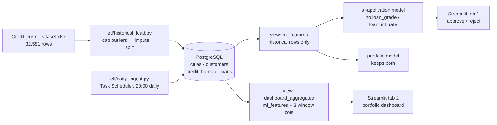

# Credit Risk & Loan Approval Pipeline

Scaffold for the 17-session plan in `docs/Credit_Risk_Pipeline_Plan_v3.md`, with fixes already
integrated from a direct audit of `Credit_Risk_Dataset.xlsx` (32,581 rows, 29 columns).

## Pipeline shape



The split into two views is the load-bearing part: `ml_features` is what training reads,
and it structurally cannot expose the three dashboard-only window columns — one of which
is `AVG(loan_status)`, the target itself. That's a schema-level guarantee, not a
convention someone has to remember.

## Results

Test set is a stratified 20% holdout (`random_state=42`), same split for every row below.
Base rate is 21.8% defaults, which is also the PR-AUC a no-skill model scores.

| Model | Feature set | Holdout ROC-AUC | Holdout PR-AUC | 5-fold CV ROC-AUC |
|---|---|---|---|---|
| Logistic Regression (session 9) | `portfolio` | 0.8713 | 0.7206 | 0.8701 ± 0.0030 |
| Logistic Regression (session 9) | `at_application` | 0.8072 | 0.6240 | 0.8062 ± 0.0083 |
| XGBoost (session 10) | `portfolio` | 0.9372 | 0.8846 | — |
| XGBoost + `scale_pos_weight` (session 10-11) | **`at_application`** | **0.8907** | **0.8055** | **0.8923 ± 0.0048** |
| XGBoost + SMOTE (session 11) | `at_application` | 0.8707 | 0.7796 | 0.8715 ± 0.0055 |

CV figures use `StratifiedKFold(shuffle=True)`. Shuffling is not optional here: the rows
of `ml_features` are not randomly ordered with respect to the target (default rate across
five contiguous blocks of the table runs 27.8%, 19.1%, 24.3%, 18.0%, 20.0%), so unshuffled
folds measure the table's row order rather than the model. An earlier version of this
section quoted 0.8606 ± 0.0355 from unshuffled CV and drew the wrong conclusion from it —
see `notebooks/04_smote_comparison.ipynb` for the correction.

**Session 11 result**: `scale_pos_weight` beats SMOTE by 0.026 PR-AUC, with
non-overlapping fold ranges — every fold prefers it. The shipped at-application model
therefore trains on real rows only, with the loss reweighted, rather than on synthesised
minority rows.

`at_application` is the model that matters — it excludes `loan_grade` and `loan_int_rate`,
which are underwriting *outputs* and therefore unavailable at the moment an application is
actually decided. The gap to `portfolio` is the measurable cost of refusing to use them.

**Caveat on the ceiling**: session 8's scan found 9 of the 18 at-application features are
statistically indistinguishable from noise (`past_delinquencies` single-feature AUC 0.5004,
`open_accounts` 0.4980, `credit_utilization_ratio` 0.5051) — almost certainly synthetic
augmentation generated independently of the target. The real signal comes from the
original dataset's own columns, and SHAP importance assigned to the noise columns in
session 12 should be read as fitting randomness.

## Differences from the original plan

| # | Issue | Fixed in |
|---|---|---|
| 1 | `loan_grade`/`loan_int_rate` are near-deterministic with the target → leakage if used as input for the new-application form | `app/app.py`, split into 2 model bundles |
| 2 | 5 rows with `person_age`=144/123, 2 rows with `person_emp_length`=123 at age 21-22 | `etl/historical_load.py::clean_outliers`, `sql/schema.sql` CHECK constraints |
| 3 | `loan_percent_income` and `loan_to_income_ratio` are duplicates (corr=0.9989) | `etl/historical_load.py::drop_redundant_columns` |
| 4 | Source data has no date column → monthly dashboard has no history | `etl/historical_load.py::backfill_loan_dates` |
| 5 | `ON CONFLICT (loan_id)` doesn't work because `loan_id` is SERIAL | `sql/schema.sql` (`application_ref`), `etl/daily_ingest.py` |
| 6 | Daily synthetic applications leak into the training set if not filtered | `sql/schema.sql` (`data_source`), `sql/views.sql` (`ml_features`) |
| 7 | A `locations` table would repeat coordinates 32,581 times for only 18 real city combos | `sql/schema.sql` (separate `cities` table) |

## Structure

> Update this tree in the same commit that adds, renames or removes a file — not "later".
> It has gone stale more than once (`03_xgboost_model.ipynb` existed for two sessions
> before it appeared here), and a tree that's only sometimes right is worse than no tree,
> because a reader can't tell which parts to trust.

```
credit-risk-pipeline/
├── sql/
│   ├── schema.sql              # DDL — see the comments in the file for rationale
│   └── views.sql                # ml_features (training) + dashboard_aggregates (Streamlit)
├── etl/
│   ├── config.py                # Postgres connection from .env
│   ├── historical_load.py       # bulk-loads the historical dataset
│   └── daily_ingest.py          # simulates new daily applications
├── notebooks/
│   ├── 01_eda.ipynb             # session 8: EDA, missingness, leakage scan
│   ├── 02_baseline_model.ipynb  # session 9: baseline Logistic Regression, 2 feature sets
│   ├── 03_xgboost_model.ipynb   # session 10: XGBoost + scale_pos_weight
│   └── 04_smote_comparison.ipynb # session 11: SMOTE vs scale_pos_weight
├── model/
│   ├── features.py              # column bookkeeping (id/target/leakage/protected/categorical)
│   ├── preprocessing.py         # ColumnTransformer + Pipeline, shared by every session
│   └── bundle.py                 # validates the model-bundle contract app.py depends on
├── models/                      # model bundles (.pkl) saved here
├── app/
│   ├── app.py                   # Streamlit, 2 tabs
│   └── utils.py
├── tests/                       # pytest — etl/, model/, and SQL structural tests
├── scripts/
│   └── dump_db.sh                # snapshots the running DB into db-seed/
├── db-seed/
│   └── 01_seed.sql                # auto-loaded by Postgres on an empty volume
├── docker-compose.yml           # Postgres
├── pyproject.toml               # dependencies (uv) — source of truth, no requirements.txt
└── .env.example
```

## Why both the Excel file and the SQL seed are committed

`data/Credit_Risk_Dataset.xlsx` (6.1 MB) and `db-seed/01_seed.sql` (8.8 MB) hold the same
32,581 records — the seed is just the Excel file after it has been through the ETL. That
duplication is deliberate, and they answer different questions:

- **The `.xlsx` is the provenance.** It's the untouched input, so the outlier capping,
  imputation and normalisation in `etl/historical_load.py` can be re-run and audited
  against their real source. Without it the ETL is unverifiable and the "differences from
  the original plan" table above is unreproducible.
- **The seed is the convenience.** `docker compose up -d` restores a working database —
  schema, data and both views — in seconds, so nobody has to install Python and run the
  ETL just to look at the project.

**The cost**: `scripts/dump_db.sh` rewrites the whole 8.8 MB seed each time, and git keeps
every version forever, so each refresh permanently adds several MB to the repo. Refresh
the seed only when the *data* actually changes, not as a routine step. If the repo ever
grows unreasonable, the seed is the one to drop — the `.xlsx` plus the ETL can always
regenerate it, but nothing can regenerate the `.xlsx`.

## Running from scratch

Fastest path — restore the committed snapshot instead of re-running the ETL:

```bash
cp .env.example .env               # set a real password
uv sync                            # installs from pyproject.toml + uv.lock — the only
                                    # dependency source in this repo, no requirements.txt
docker compose up -d               # db-seed/01_seed.sql auto-loads on first init — includes
                                    # schema, data, and the ml_features/dashboard_aggregates views
uv run jupyter notebook notebooks/01_eda.ipynb
uv run streamlit run app/app.py
```

To rebuild that snapshot from the raw dataset instead:

```bash
cp .env.example .env
uv sync
docker compose up -d
docker exec -i credit-db psql -U postgres -d credit_db -f - < sql/schema.sql
docker exec -i credit-db psql -U postgres -d credit_db -f - < sql/views.sql   # ml_features, dashboard_aggregates
uv run python etl/historical_load.py
uv run python etl/daily_ingest.py
bash scripts/dump_db.sh             # refreshes db-seed/01_seed.sql
```

`sql/views.sql` only needs to run once (or again if the view *definitions* change) —
they're views, not materialized tables, so they always reflect live data. Re-running
`daily_ingest.py` never requires re-running `sql/views.sql`.
