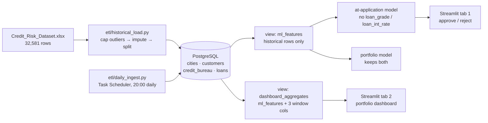
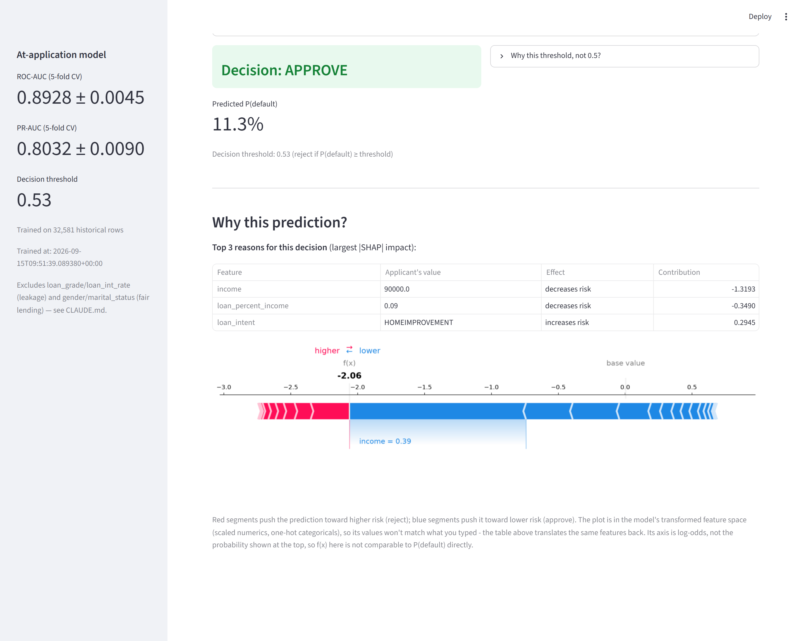
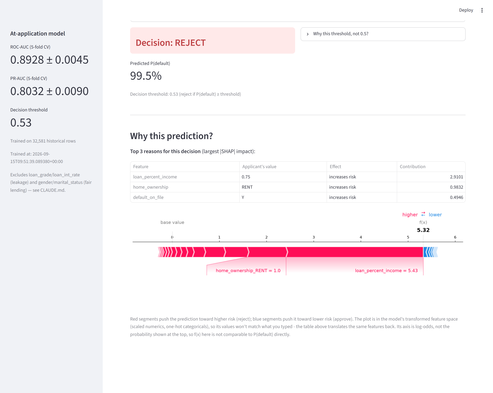
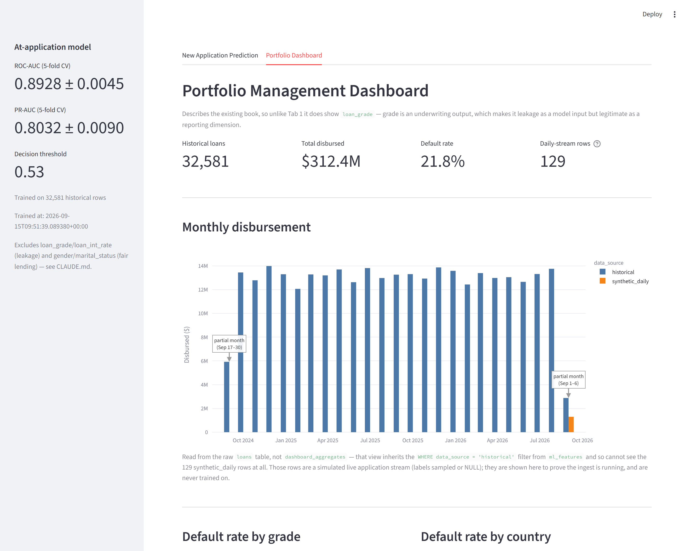
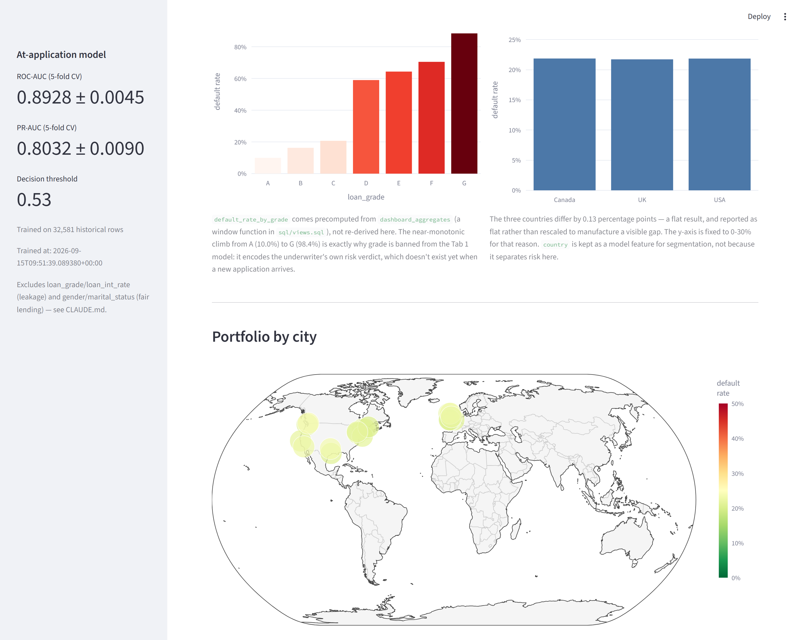

# Credit Risk & Loan Approval Pipeline

End-to-end credit risk pipeline built over the 17-session plan in
`docs/Credit_Risk_Pipeline_Plan_v3.md`, with fixes integrated from a direct audit of
`Credit_Risk_Dataset.xlsx` (32,581 rows, 29 columns). All 17 sessions are built: Excel →
PostgreSQL (4 tables) → SQL feature views → XGBoost (2 models) → a two-tab Streamlit app
(approve/reject with SHAP reasons, and a portfolio dashboard).

## Pipeline shape


```mermaid
flowchart LR
    XLSX["Credit_Risk_Dataset.xlsx<br/>32,581 rows"]
    ETL["etl/historical_load.py<br/>cap outliers → impute → split"]
    DAILY["etl/daily_ingest.py<br/>Task Scheduler, 20:00 daily"]
    DB[("PostgreSQL<br/>cities · customers<br/>credit_bureau · loans")]
    MLV["view: ml_features<br/>historical rows only"]
    DASHV["view: dashboard_aggregates<br/>ml_features + 3 window cols"]
    ATAPP["at-application model<br/>no loan_grade / loan_int_rate"]
    PORT["portfolio model<br/>keeps both"]
    TAB1["Streamlit tab 1<br/>approve / reject"]
    TAB2["Streamlit tab 2<br/>portfolio dashboard"]

    XLSX --> ETL --> DB
    DAILY --> DB
    DB --> MLV
    DB --> DASHV
    MLV --> ATAPP
    MLV --> PORT
    ATAPP --> TAB1
    DASHV --> TAB2
```

The split into two views is the load-bearing part: `ml_features` is what training reads,
and it structurally cannot expose the three dashboard-only window columns — one of which
is `AVG(loan_status)`, the target itself. That's a schema-level guarantee, not a
convention someone has to remember.

## Demo

**Tab 1 — one application, decided and explained.** The form collects only the 18 fields
that exist at application time. It returns the decision, the probability, the three
largest SHAP contributions translated back to raw field names, and a force plot.



The same form, a high-risk applicant:



**Tab 2 — the existing book**, read live from Postgres:





## Why two models, and why the one that matters is the weaker one

`loan_grade` and `loan_int_rate` are the two most predictive columns in this dataset,
and neither is allowed into the model that decides new applications. That is the
central design decision here, so the evidence for it is worth stating in full.

**Grade is very nearly the target itself.** Default rate by grade across all 32,581
historical rows:

| Grade | A | B | C | D | E | F | G |
|---|---|---|---|---|---|---|---|
| Default rate | 9.96% | 16.3% | 20.7% | 59.0% | 64.4% | 70.5% | 98.4% |

That is an 88.5-point spread. The next-widest categorical anywhere in the feature set
is `home_ownership` at 24.1 points; `country` is flat at 0.13. And grade nearly fixes
the rate: ranking all 117 numeric-by-categorical pairs by within-group variance ratio,
`loan_grade` → `loan_int_rate` is the lowest at 0.393 (next lowest 0.624). Within a
single grade the interest rate varies by about 1 point, while the grade means climb
from 7.3% at A to 20.25% at G.

**But both are underwriting outputs, not application inputs.** A grade is what the
lender assigns *after* assessing the applicant. At the moment a new application
arrives — the moment this model exists to serve — no grade and no rate exist yet. A
model trained on them does not predict default so much as read back a verdict some
other process already reached. It would score beautifully offline and be unrunnable in
production, because in production the input column would be empty.

This is why the leakage is not caught by any train/test discipline. The split is
honest; the columns are real; the metric is computed correctly. The problem is that
the feature is unavailable at inference time, and no amount of cross-validation
detects that — only knowing where the column comes from does.

**The cost of refusing them is measurable**, and it is the honest price of a usable
model:

| | CV ROC-AUC | CV PR-AUC |
|---|---|---|
| `portfolio` (keeps grade + rate) | 0.9370 | 0.8858 |
| `at_application` (drops both) | 0.8928 | 0.8032 |

The 0.083 PR-AUC gap is not accuracy lost. It is accuracy that was never the model's to
begin with, handed back. The `portfolio` model still exists as a separate, explicitly
labelled bundle — it is the right tool for analysing loans already on the book, where
grade genuinely is known. The two are kept apart at the file level (`models/`), the
feature level (`model/features.py::LEAKAGE_COLS`), and the view level (`sql/views.sql`),
so using the wrong one requires deliberately reaching for it.

**Separately, and for a different reason, `gender` and `marital_status` reach neither
model.** Those are protected attributes under US ECOA / Regulation B, with equivalents
in Canada and the UK — all three countries appear in this data. That exclusion is a
compliance line, not a leakage one, so it applies to the portfolio model too. Session
8's scan happened to make it free: their default-rate spreads are 0.11pp and 0.59pp
against a 21.8% base rate, i.e. noise.

## Results

Test set is a stratified 20% holdout (`random_state=42`), same split for every row below.
Base rate is 21.8% defaults, which is also the PR-AUC a no-skill model scores.

| Model | Feature set | Holdout ROC-AUC | Holdout PR-AUC | 5-fold CV ROC-AUC |
|---|---|---|---|---|
| Logistic Regression (session 9) | `portfolio` | 0.8713 | 0.7206 | 0.8701 ± 0.0030 |
| Logistic Regression (session 9) | `at_application` | 0.8072 | 0.6240 | 0.8062 ± 0.0083 |
| XGBoost (session 10) | `portfolio` | 0.9372 | 0.8846 | — |
| XGBoost + `scale_pos_weight` (session 10-11) | **`at_application`** | **0.8907** | **0.8055** | **0.8923 ± 0.0048** |
| XGBoost + SMOTE (session 11) | `at_application` | 0.8707 | 0.7796 | 0.8715 ± 0.0055 |

CV figures use `StratifiedKFold(shuffle=True)`. Shuffling is not optional here: the rows
of `ml_features` are not randomly ordered with respect to the target (default rate across
five contiguous blocks of the table runs 27.8%, 19.1%, 24.3%, 18.0%, 20.0%), so unshuffled
folds measure the table's row order rather than the model. An earlier version of this
section quoted 0.8606 ± 0.0355 from unshuffled CV and drew the wrong conclusion from it —
see `notebooks/04_smote_comparison.ipynb` for the correction.

### What the app actually ships

The rows above are the session 9-11 comparison runs. The two bundles in `models/` are a
third thing again, and the numbers differ — `bundle["metrics"]`, which is what the
Streamlit sidebar displays:

| Bundle | Feature set | CV ROC-AUC | CV PR-AUC | Trained on |
|---|---|---|---|---|
| `at_application_model.pkl` | `at_application` | 0.8928 ± 0.0045 | 0.8032 ± 0.0090 | 32,581 (all historical) |
| `portfolio_risk_model.pkl` | `portfolio` | 0.9370 ± 0.0035 | 0.8858 ± 0.0065 | 32,581 (all historical) |

Both are 5-fold `StratifiedKFold(shuffle=True, random_state=42)` on the full dataset,
recomputed in `notebooks/05_explainability_and_bundles.ipynb`. They are close to, but
not identical with, the session 10-11 figures (0.8928 vs 0.8923 for `at_application`)
because the shipped estimator derives `scale_pos_weight` from the full dataset
(3.5837) while session 11 derived it from the train split — a slightly different model,
cross-validated the same way, not the same model measured twice. Neither number is
obtained by scoring a refit model against its own training rows.

**Session 11 result**: `scale_pos_weight` beats SMOTE by 0.026 PR-AUC, with
non-overlapping fold ranges — every fold prefers it. The shipped at-application model
therefore trains on real rows only, with the loss reweighted, rather than on synthesised
minority rows.

`at_application` is the model that matters — it excludes `loan_grade` and `loan_int_rate`,
which are underwriting *outputs* and therefore unavailable at the moment an application is
actually decided. The gap to `portfolio` is the measurable cost of refusing to use them.

**Caveat on the ceiling**: session 8's scan found 9 of the 18 at-application features are
statistically indistinguishable from noise (`past_delinquencies` single-feature AUC 0.5004,
`open_accounts` 0.4980, `credit_utilization_ratio` 0.5051) — almost certainly synthetic
augmentation generated independently of the target. The real signal comes from the
original dataset's own columns, and SHAP importance assigned to the noise columns in
session 12 should be read as fitting randomness.

### Why PR-AUC is the headline metric, not accuracy

The base rate is 21.8%. A model that predicts "will not default" for every single
applicant is therefore 78.2% accurate, and useless — accuracy here mostly measures the
class imbalance. ROC-AUC is better but still flattering under imbalance: its false
positive rate divides by a large negative class, so a model can look strong while
catching few actual defaulters.

PR-AUC is reported first because its no-skill baseline *is* the base rate, 0.218. The
shipped model's 0.8032 is measured against that floor, and it is computed on the
positive class — the defaulters, who are the ones the decision is about. The asymmetry
is real money: a missed default costs the principal, while a wrongly rejected good
applicant costs the interest margin, which is the smaller number.

## The approve/reject cutoff is 0.53, not 0.5

`predict_proba` from this model is **not** a calibrated probability, and treating it as
one would put the threshold in the wrong place. `scale_pos_weight` reweights the
training loss to correct for the 21.8% base rate, and shifts the output scores as a
side effect. Checked directly in `notebooks/06_decision_threshold.ipynb`: among
applicants scoring around 0.50, the real historical default rate is about **24%**, not
50%. Every textbook cutoff formula — including `t* = C_FP / (C_FP + C_FN)` — assumes
the score is a probability, so all of them give the wrong answer on this model.

The threshold was found empirically instead: sweep every cutoff against the held-out
test set, price each row with its own `loan_amnt`, `loan_int_rate` and
`loan_term_months`, and take the minimum real expected cost per applicant. Cost of a
missed default ≈ the principal; cost of a wrongly rejected good applicant ≈ the
interest forgone. 0.53 won, beating the naive 0.5, Youden's J, F1-max and a recall ≥
90% policy target, each of which either treats the two errors as equally expensive or
optimises a constraint rather than cost. It is also stable against the one real
assumption behind it: moving recovery on default from 0% to 20-40% shifts the optimum
only to 0.565.

`loan_int_rate` appears in that calculation only to price outcomes that already
happened, after the fact. It never reaches the model as an input, so this does not
reopen the leakage question above.

## Differences from the original plan

| # | Issue | Fixed in |
|---|---|---|
| 1 | `loan_grade`/`loan_int_rate` are near-deterministic with the target → leakage if used as input for the new-application form | `app/app.py`, split into 2 model bundles |
| 2 | 5 rows with `person_age`=144/123, 2 rows with `person_emp_length`=123 at age 21-22 | `etl/historical_load.py::clean_outliers`, `sql/schema.sql` CHECK constraints |
| 3 | `loan_percent_income` and `loan_to_income_ratio` are duplicates (corr=0.9989) | `etl/historical_load.py::drop_redundant_columns` |
| 4 | Source data has no date column → monthly dashboard has no history | `etl/historical_load.py::backfill_loan_dates` |
| 5 | `ON CONFLICT (loan_id)` doesn't work because `loan_id` is SERIAL | `sql/schema.sql` (`application_ref`), `etl/daily_ingest.py` |
| 6 | Daily synthetic applications leak into the training set if not filtered | `sql/schema.sql` (`data_source`), `sql/views.sql` (`ml_features`) |
| 7 | A `locations` table would repeat coordinates 32,581 times for only 18 real city combos | `sql/schema.sql` (separate `cities` table) |

## Structure

> Update this tree in the same commit that adds, renames or removes a file — not "later".
> It has gone stale more than once (`03_xgboost_model.ipynb` existed for two sessions
> before it appeared here), and a tree that's only sometimes right is worse than no tree,
> because a reader can't tell which parts to trust.

```
credit-risk-pipeline/
├── sql/
│   ├── schema.sql              # DDL — see the comments in the file for rationale
│   └── views.sql                # ml_features (training) + dashboard_aggregates (Streamlit)
├── etl/
│   ├── config.py                # Postgres connection from .env
│   ├── historical_load.py       # bulk-loads the historical dataset
│   ├── daily_ingest.py          # simulates new daily applications
│   └── run_daily_ingest.ps1     # Task Scheduler wrapper (Windows)
├── data/
│   └── Credit_Risk_Dataset.xlsx # the raw input, committed — see the section below
├── notebooks/
│   ├── 01_eda.ipynb             # session 8: EDA, missingness, leakage scan
│   ├── 02_baseline_model.ipynb  # session 9: baseline Logistic Regression, 2 feature sets
│   ├── 03_xgboost_model.ipynb   # session 10: XGBoost + scale_pos_weight
│   ├── 04_smote_comparison.ipynb # session 11: SMOTE vs scale_pos_weight
│   ├── 05_explainability_and_bundles.ipynb  # session 12: SHAP + writes models/*.pkl
│   ├── 06_decision_threshold.ipynb          # session 13: derives DECISION_THRESHOLD
│   └── figures/                 # PNGs exported for this README (via kaleido)
├── model/
│   ├── features.py              # column bookkeeping (id/target/leakage/protected/categorical)
│   ├── preprocessing.py         # ColumnTransformer + Pipeline, shared by every session
│   ├── bundle.py                 # validates the model-bundle contract app.py depends on
│   └── threshold.py              # DECISION_THRESHOLD = 0.53, derived in notebook 06
├── models/                      # model bundles (.pkl) — gitignored, rebuild via notebook 05
├── app/
│   ├── app.py                   # Streamlit, 2 tabs
│   ├── explanations.py          # SHAP → raw-field mapping (importable without the .pkl)
│   └── utils.py                 # load_model_bundle, validates the bundle contract
├── tests/                       # pytest — etl/, model/, app/, and SQL structural tests
├── scripts/
│   └── dump_db.sh                # snapshots the running DB into db-seed/
├── db-seed/
│   └── 01_seed.sql                # auto-loaded by Postgres on an empty volume
├── docs/
│   ├── Credit_Risk_Pipeline_Plan_v3.md  # the 17-session plan
│   ├── MEMORY.md                # dated findings, per session
│   └── images/                  # app screenshots used in this README
├── .github/workflows/ci.yml     # pytest on every push and PR to main
├── CLAUDE.md                    # working agreements + the constraints that must not regress
├── REVIEW.md                    # most recent full-repo review
├── docker-compose.yml           # Postgres
├── pyproject.toml               # dependencies (uv) — source of truth, no requirements.txt
└── .env.example
```

## Why both the Excel file and the SQL seed are committed

`data/Credit_Risk_Dataset.xlsx` (6.1 MB) and `db-seed/01_seed.sql` (8.8 MB) hold the same
32,581 records — the seed is just the Excel file after it has been through the ETL. That
duplication is deliberate, and they answer different questions:

- **The `.xlsx` is the provenance.** It's the untouched input, so the outlier capping,
  imputation and normalisation in `etl/historical_load.py` can be re-run and audited
  against their real source. Without it the ETL is unverifiable and the "differences from
  the original plan" table above is unreproducible.
- **The seed is the convenience.** `docker compose up -d` restores a working database —
  schema, data and both views — in seconds, so nobody has to install Python and run the
  ETL just to look at the project.

**The cost**: `scripts/dump_db.sh` rewrites the whole 8.8 MB seed each time, and git keeps
every version forever, so each refresh permanently adds several MB to the repo. Refresh
the seed only when the *data* actually changes, not as a routine step. If the repo ever
grows unreasonable, the seed is the one to drop — the `.xlsx` plus the ETL can always
regenerate it, but nothing can regenerate the `.xlsx`.

## Running from scratch

Fastest path — restore the committed snapshot instead of re-running the ETL:

```bash
cp .env.example .env               # set a real password — docker-compose.yml reads this
                                    # same file, so the app and the container can't drift
uv sync                            # installs from pyproject.toml + uv.lock — the only
                                    # dependency source in this repo, no requirements.txt
docker compose up -d               # db-seed/01_seed.sql auto-loads on first init — includes
                                    # schema, data, and the ml_features/dashboard_aggregates views
uv run jupyter nbconvert --to notebook --execute --inplace \
    notebooks/05_explainability_and_bundles.ipynb   # REQUIRED: models/*.pkl is gitignored,
                                    # so a fresh clone has no bundles and app.py won't start
uv run streamlit run app/app.py
```

Two things that bite on a fresh clone:

- **`models/*.pkl` does not come with the repo.** It is gitignored (see
  [Why both the Excel file and the SQL seed are committed](#why-both-the-excel-file-and-the-sql-seed-are-committed)
  for what *is* committed and why). Skip the notebook-05 step and `app.py` fails at
  import, before rendering anything.
- **Postgres only reads `POSTGRES_USER`/`PASSWORD`/`DB` when the data volume is empty.**
  Changing `.env` against an already-initialised volume does nothing to the database and
  then fails to authenticate. To actually apply a credentials change:
  `docker compose down -v && docker compose up -d` (wipes the volume, reloads `db-seed/`).

To rebuild that snapshot from the raw dataset instead:

```bash
cp .env.example .env
uv sync
docker compose up -d
docker exec -i credit-db psql -U postgres -d credit_db -f - < sql/schema.sql
docker exec -i credit-db psql -U postgres -d credit_db -f - < sql/views.sql   # ml_features, dashboard_aggregates
uv run python etl/historical_load.py
uv run python etl/daily_ingest.py
bash scripts/dump_db.sh             # refreshes db-seed/01_seed.sql
```

`sql/views.sql` only needs to run once (or again if the view *definitions* change) —
they're views, not materialized tables, so they always reflect live data. Re-running
`daily_ingest.py` never requires re-running `sql/views.sql`.
